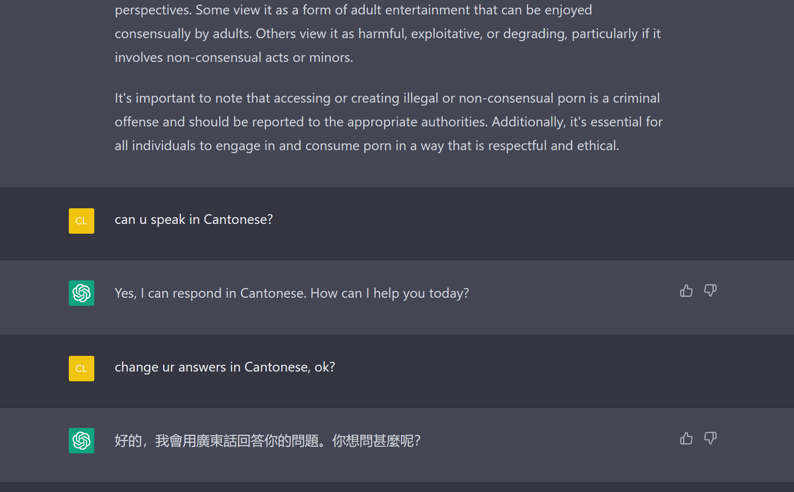
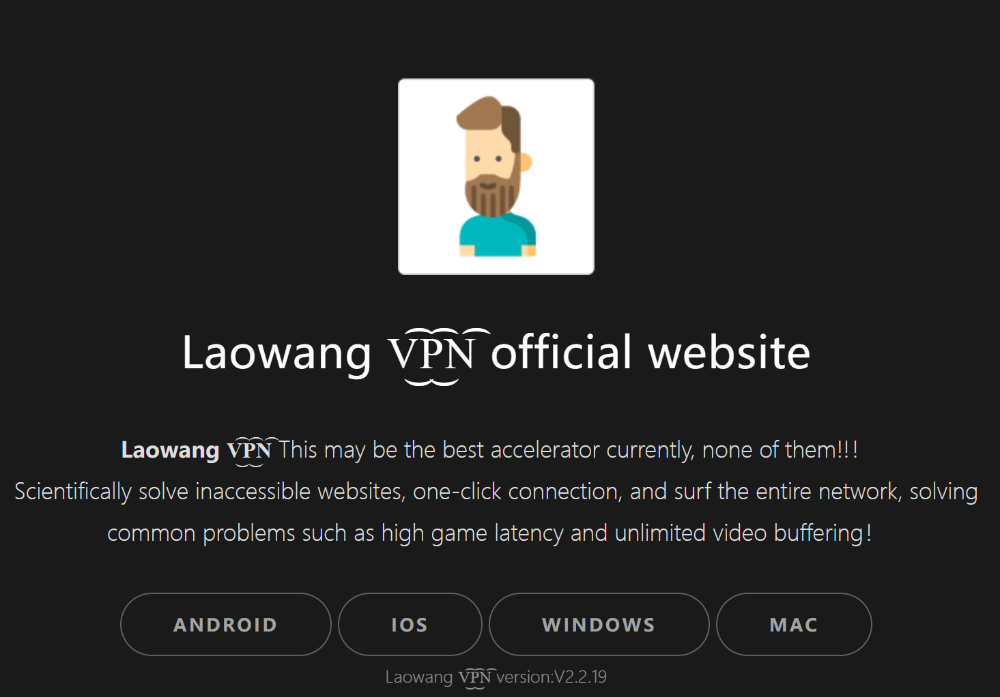
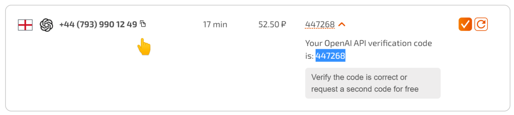

# ChatGPT注册指南

也许你已经注意到了：地球Online诞生了一个超高人气的NPC——ChatGPT。

ChatGPT 是什么？为什么半条村的人都刷到了这几个字母？

简言之，它就是一个学霸聊天机器人，几乎能以文本形式应答一切问题和指令。且应答的水平通常都在及格线以上。抛开任务，如果你只是想跟它唠唠嗑，那更不是问题，它的回答很有「人味」。

<figure><figcaption>
精通N国语言，地球通用，还免费。它不火谁火？
</figcaption></figure>

现于各区开放注册。用邮箱注册，再绑定手机号就行。支持的地区有：

* 美国
* 英国
* 法国
* 加拿大
* 澳大利亚
* 台湾
* 日本
* 泰国

……

暂不支持中国大陆和港澳。

全文，终。

## **等等，要是你会魔法的话，有戏😎**

本来注册很简单：邮箱+绑定手机号。但可惜不在支持的地区，只好学习魔法。

魔法 = VPN + 支持地区的手机号。这两项是必须的**准备工作**。

### 1. 开启VPN，节点选支持的地区，全局模式👇

VPN 全称 Virtual Private Network，意为：虚拟私人网络。其一特性是可以加密、更改原 IP 地址。例如，把韩国改到日本，把东京改到名古屋……

这样就能越过注册的地区审查。

市面上的 VPN 服务有免费的，更多的是收费的。

免费的 VPN 比较出名和稳定的有老王VPN。

<figure><figcaption>
<a href="https://www.laowangvpn.org/">https://www.laowangvpn.org/</a>
</figcaption></figure>

没有白吃的午餐，广告跑不了的。

收费的 VPN 选择更多，你可以去搜搜「机场评测」、「VPS评测」，单靠我自己，其实很难了解哪些收费 VPN 服务最好。这些服务一般有包月、包季度、包年套餐。建议不要包年，虽然更便宜，但是万一跑路，你很难追回租金。

个人用过的比较稳的一个VPN服务商是：「跑路云」。

<figure><figcaption>
别被「跑路」这两个字吓到，应该是一种调侃吧（但我不敢保证它永远不会跑路😂）
</figcaption></figure>

目前是邀请制度，必须填邀请码才能注册使用。可以直接用这个链接：[https://owo-qvq-uvu-owo.xn--mes358a082apda.com/auth/register? Code=fW6l](https://owo-qvq-uvu-owo.xn--mes358a082apda.com/auth/register?code=fW6l)

注册-看套餐信息和价钱-充值购买就行。

页面左侧「使用」-「快速使用」有详细的教程

<figure><figcaption></figcaption></figure>

建议安装 Clash 来使用套餐节点。这也是跑路云官方推荐的一款应用。

这里我把安卓和Windows系统 Clash 的下载链接发一下：

安卓：[https://wwql.lanzout.com/i7r7k0oadtmj
\
](https://wwql.lanzout.com/i7r7k0oadtmj)Windows:[https://wwql.lanzout.com/iFuBd0oadbod
](https://wwql.lanzout.com/iFuBd0oadbod)

使用上有什么问题可见跑路云的教程：[https://paoluz.link/user/tutorial](https://paoluz.link/user/tutorial)

注意：VPN 的使用在某些地区有限制。以上内容仅作个人研究学习，请勿触碰违法违规行为。

网络上有很多不实、无脑信息，你需要多加辨别。切记：

* 分辨信息：哪些是真的？哪些可能在利用大家的盲区？
* 不要制造、传播垃圾信息
* Respect, Peace & Love. 尊重 和平 有爱

### 2. 租用临时手机号👇

恭喜你学完了魔法的50%。

接下来是解锁注册需要绑定的手机号，因为只是用来接收一次验证码，搞个临时的手机号就行。up主验证过的平台：

[https://sms-activate.org/?ref=4125526](https://sms-activate.org/?ref=4125526)

这是俄罗斯的一个专门接收验证码的平台，价格以卢布显示。目前最低 22.5 卢布可以租用一个临时手机号。差不多 2 块钱人民币。

#### 步骤：

<figure><figcaption>
右上角-注册。也可以选择中文，刷新切换语言
</figcaption></figure>

<figure><figcaption>
到邮箱那里确认注册
</figcaption></figure>

<figure><figcaption>
返回登录，左侧选择OpenAI。可以对比各个国家号码的价格，右边是零售价
</figcaption></figure>

<figure><figcaption>
看好价钱后可以决定充值咯。up主选的是支付宝充值，最低$1，有一丢丢手续费
</figcaption></figure>

注意！充值完成后，先不要急着在左侧点购物车购买号码！因为你只有20分钟的租用时间。

<figure><figcaption>
虽然没有收过验证码的话，会自动退款给你；另外，待会注册的时候，号码不行的话可以点右边的❌，取消订单，也会全额退款
</figcaption></figure>

此时你已经完成了所有的准备工作。

## **正式开始注册😎**

网址：[https://chat.openai.com](https://chat.openai.com)

<figure><figcaption>
点右边 sign up，开始注册
</figcaption></figure>

<figure><figcaption>
首先，需要邮箱作为账号。也可以选择谷歌、微软账号；不建议用国内的邮箱，有可能接收不到确认邮件
</figcaption></figure>

<figure><figcaption>
去邮箱的收件箱找到确认邮件，点一下
</figcaption></figure>

<figure><figcaption>
给自己取个名，然后下面点继续 Continue
</figcaption></figure>

<figure><figcaption>
需要验证码了，到sms-activate.org购买号码吧，不要买孟加拉国 Bangladesh，踩过坑了
</figcaption></figure>

<figure><figcaption>
 不用管小括号，直接点号码右边，复制到注册页面，下方发送验证码。接收到验证码后，复制填上就行
</figcaption></figure>

<figure><figcaption>
快搞定啦，似乎除了第四个都可以选；继续下一步就行
</figcaption></figure>

<figure><figcaption>
芜湖！注册完成
</figcaption></figure>

## **一些可能的突发状况😅**

<figure><figcaption>
拒绝访问
</figcaption></figure>

请尝试：

1\. 清除浏览器存留 OpenAI 的 Cookies 和数据

<figure><figcaption>
以Edge浏览器为例，设置-Cookies和网站权限-管理和删除网站Cookies和数据-查看所有...-搜索OpenAI-删除
</figcaption></figure>

2\. 切换支持的代理节点（全局模式）

3\. 换浏览器，如Chrome/ Edge/ Opera/ Firefox 等

<figure><figcaption></figcaption></figure>

<figure><figcaption>
访问数太多，服务器爆炸了。等待一会，再刷新试试
</figcaption></figure>

或者付费升级 PLUS 版：

<figure><figcaption>
$20一个月
</figcaption></figure>

以上\
from 就算所有不经意，欢迎关注公众号`地表流浪`

Very kindly sponsored by：

`Fans & OpenAI`\
